# Turning on Developer Mode — a picture walkthrough

Developer mode unlocks your reMarkable Paper Pro so you can run your own
software on it (SSH as root, launchers like AppLoad, and the apps in this
ecosystem). This is a step-by-step guide with a photo for every screen, so you
can follow along and know you're in the right place.

> ### ⚠️ Read this first — the one surprise
> Turning on developer mode **erases everything on the tablet** (a factory
> reset). It's a security measure built in by reMarkable — no tool can skip it.
> **Your notebooks are safe if they're synced to the reMarkable cloud first**;
> they download again afterward. Anything not synced is gone.
> **Sync (or back up) before you start.**

---

## Before you begin

- [ ] **Charge to at least 30%.** Don't do this on a low battery.
- [ ] **Sync your notebooks to the cloud** (or copy them off via the USB web
      interface at `http://10.11.99.1` while plugged in). The reset erases the
      device; only synced/backed-up files survive.
- [ ] **Have ~10 minutes.** The reset and first-time setup take a little while.

> **Good to know:** developer mode does **not** void your hardware warranty
> (reMarkable just won't support software problems you introduce), and it's
> reversible later through their recovery tool.

---

## Step 1 — Open Settings

Tap your account icon (top-left of the home screen), then the gear / **Settings**.

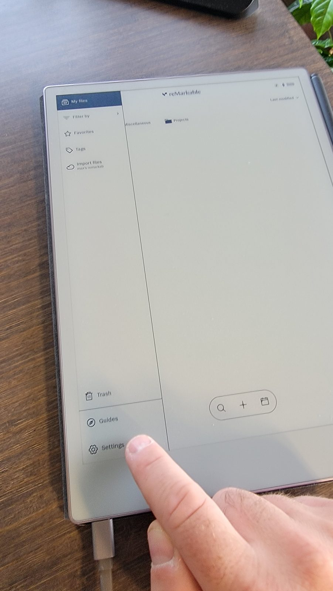

> _You'll see:_ the main Settings screen with a left-hand list (General,
> Storage, Security, …).

---

## Step 2 — General → Software

In Settings, open **General**, then tap **Software** (this is where the OS
version and advanced options live).

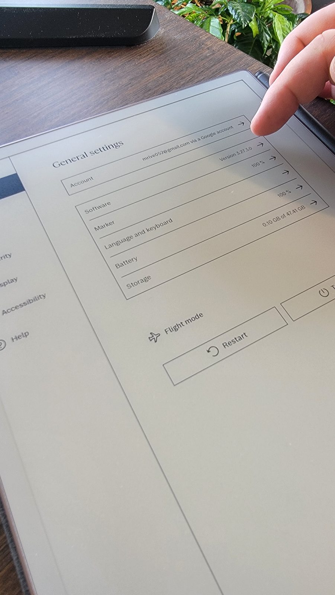

> _You'll see:_ your current software version number and, below it, an
> **Advanced** section.
>
> _Exact path (reMarkable's wording):_
> **Settings → General → Paper Tablet → Software → Advanced → Developer Mode**.
> The labels shift slightly between OS updates — follow the photo.

---

## Step 3 — Advanced → Developer Mode

On the Software screen, expand **Advanced**, then tap **Developer mode**.

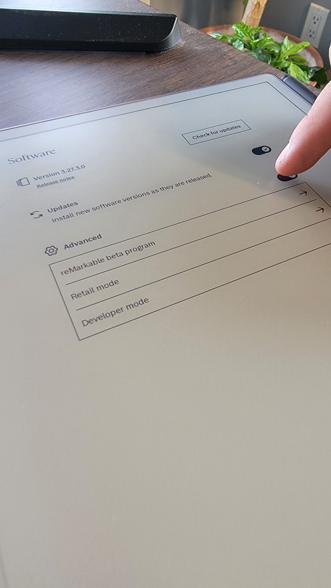

> _You'll see:_ a Developer mode screen explaining that it lets you run custom
> software and that the device will no longer verify software authenticity.

---

## Step 4 — Read the warning, then Enable

Tap **Enable**. reMarkable now shows the important warning.

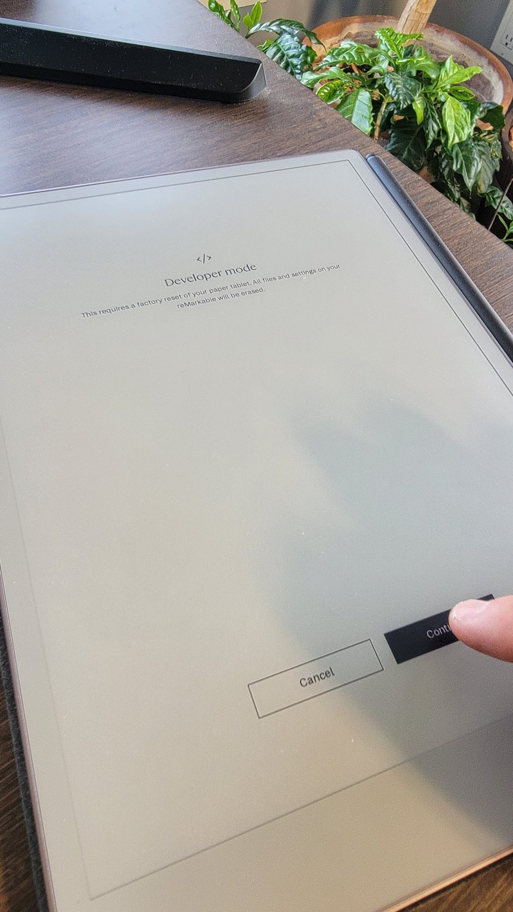

> _You'll see (reMarkable's own words):_ *"enabling developer mode also performs
> a factory reset … data on the device at the time of enabling developer mode
> will be lost."* It also warns that a small notice will appear on **every boot**
> from now on — that's normal and can't be removed (it's part of the security
> design).
>
> **This is the point of no return for un-synced data.** If you're not sure your
> notebooks are in the cloud, stop and sync first.

---

## Step 5 — Confirm (press the power button twice)

To confirm, **press the physical power button twice**, as the screen instructs.
The tablet resets and reboots into developer mode.

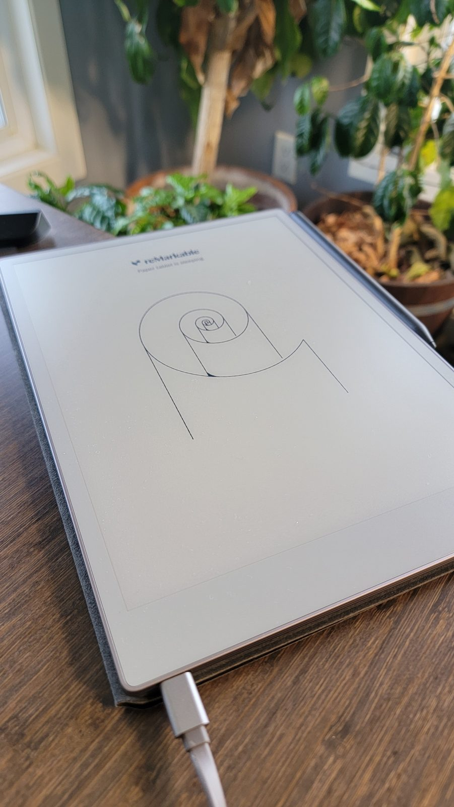

> _You'll see:_ the device restart and begin **first-time setup** again — just
> like a new tablet. Go through setup, connect to Wi-Fi, and (optionally) sign
> back into your reMarkable account so your notebooks download again.

### What first-time setup looks like

After the reset, follow the normal onboarding screens: choose a language,
connect to Wi-Fi, and pair your account if you want your notebooks to sync
back from the cloud.

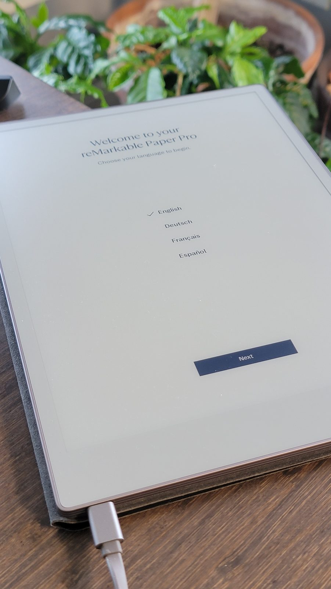

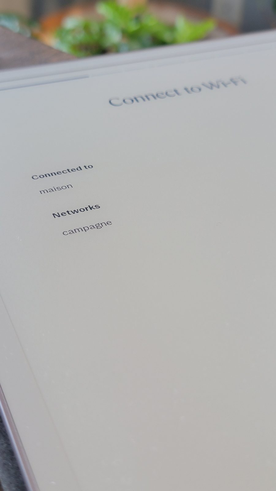

If you pair your account, the tablet asks for a one-time code from
`my.remarkable.com`:

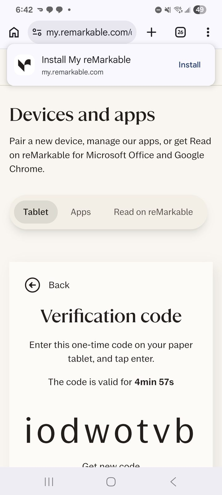

When setup is done, you're back at the normal reMarkable home screen — now in
developer mode.

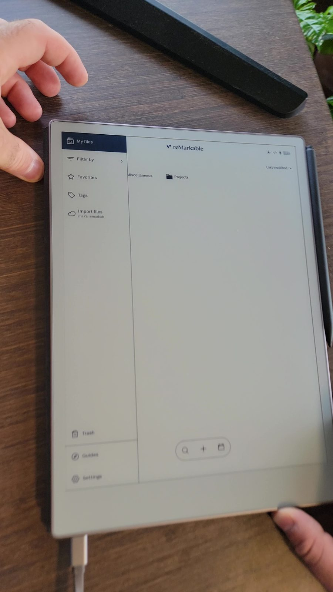

---

## Step 6 — Find your SSH password

Once you're back on the home screen, go to **Settings → Help → Copyrights and
licenses**. Scroll to the **GPLv3 Compliance / SSH** section.

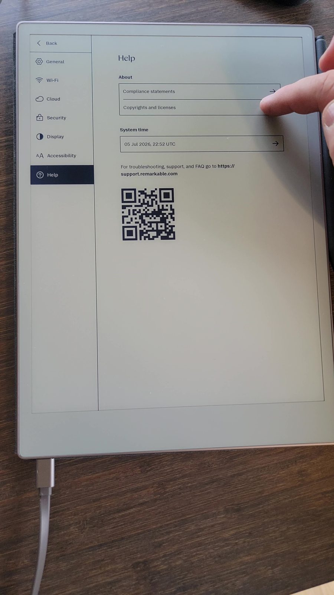

> _You'll see:_ a one-time SSH **password** and the address **`root@10.11.99.1`**.
> You'll need this the first time you connect. Keep this screen handy for the
> next step. (The photo shows the Help screen; the SSH text is inside
> **Copyrights and licenses**.)

---

## Step 7 — Connect from your computer

Plug the tablet into your computer with the USB-C cable. It appears as a small
USB network device at **`10.11.99.1`**. Test the connection:

```sh
ssh root@10.11.99.1
```

Enter the password from Step 6 when asked. You're in. 🎉

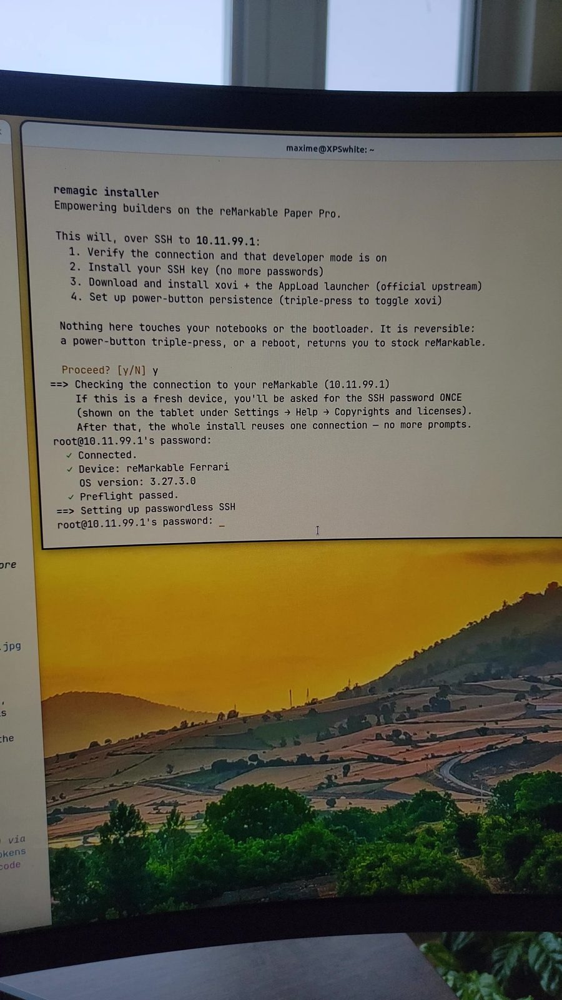

> You only type that password once — the installer sets up a key so you never
> need it again.

---

## You're done — now the fun part

Developer mode is on. Head back to the **[README](../README.md)** and run the
one-line installer:

```sh
curl -fsSL https://raw.githubusercontent.com/maximerivest/remagic/main/get.sh | sh
```

It downloads `remagic`, sets up passwordless SSH, installs xovi + AppLoad, and
adds the Store app — no more terminal wrangling.

---

## What "unlocked" really means (and what stays locked)

Developer mode relaxes the parts of security that keep *you* out of *your own*
device's software:

- ✅ Root **SSH** access.
- ✅ **Modify the filesystem** and run your own programs.
- ✅ Load a **custom kernel** (advanced; not needed for apps).

It deliberately keeps a few things locked — and these are *features*, not
obstacles, because they're what makes developer mode safe and reversible:

- 🔒 The **bootloader stays signed** (the earliest boot code can't be replaced).
- 🔒 **Disk encryption stays on** (your data is still encrypted at rest).
- 🔒 The **boot notice** and the **one-time reset** stay.

If any tool ever claims to remove the reset or the boot notice, be skeptical —
that means defeating secure boot, which breaks on every OS update and puts your
device (and warranty) at risk.

---

## Changed your mind? Leaving developer mode

You can return to a clean, stock device using reMarkable's **recovery tool**
over USB. On Linux (x86_64):

```sh
# Download reMarkable's official Linux recovery tool
curl -fLO https://device-recovery.cloud.remarkable.com/host/1.14.1/x86_64-unknown-linux-gnu-public/bin/rm_recover
chmod +x rm_recover

# Put the tablet in recovery mode: hold power ~30s, release, then a short press.
./rm_recover discover-device      # expect: status:OK
./rm_recover reset                # wipe + reinstall (or 'restore' to keep data)
```

Both `reset` and `restore` **also turn developer mode off**, returning the
device to its secure state. (Full details:
[reMarkable's recovery docs](https://developer.remarkable.com/documentation/recovery-for-linux-host).)
